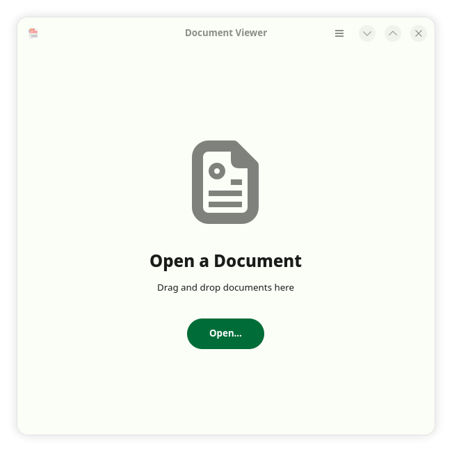
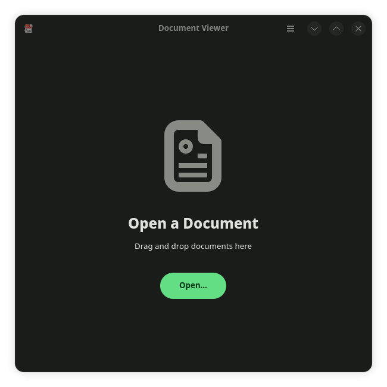
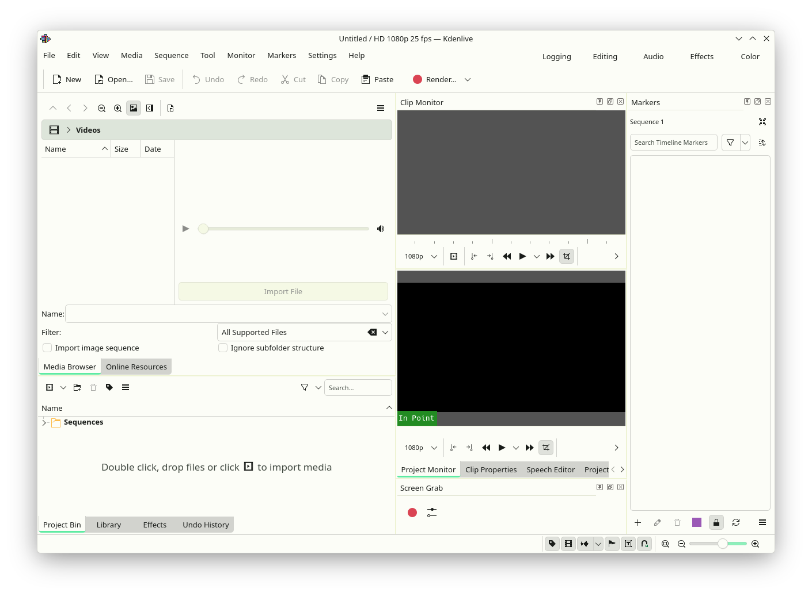
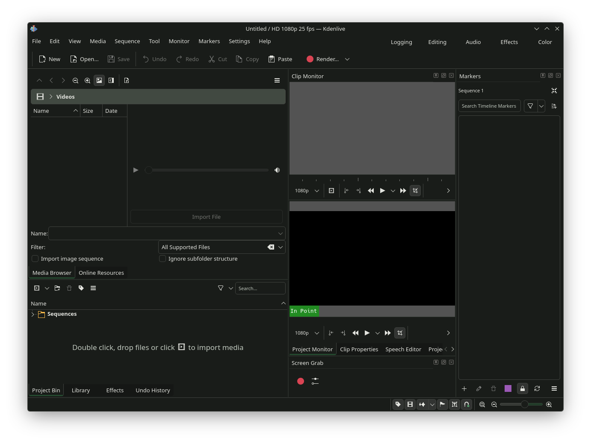

# mcugen-themes

A collection of ready-to-use theme targets for **mcugen**.

These targets are designed to be cloned or extracted directly into
`~/.config/mcugen/targets` and used as-is.

## Installation

```bash
cd ~/.config/mcugen/targets
git clone https://github.com/MeghBadonia/mcugen-themes.git
```

Or download as a ZIP and extract into the same directory.

After installing or updating themes:
- Regenerate colors using **mcugen**
- Restart affected GTK applications
- **Logging out and logging back in is preferred** to ensure all apps pick up the new colors

## Included Targets

- GTK 4 / libadwaita

## Screenshots

<p align="center">
  
  
  
  
</p>

## Notes

- Themes follow libadwaita surface and contrast rules
- Light and dark modes are handled automatically by mcugen
- No hardcoded colors — everything is driven by Material roles
